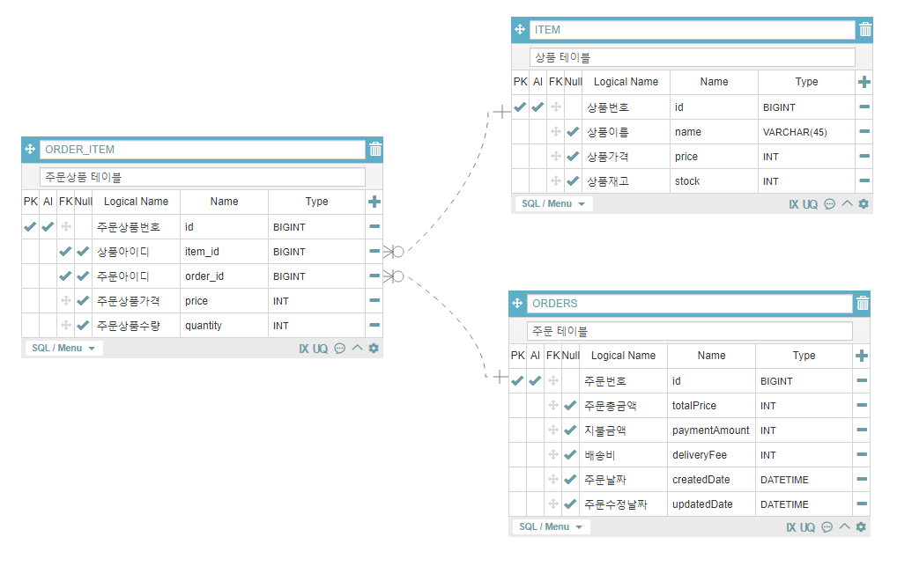

<h1>심플 주문 프로그램</h1>

 

<h3> 기술 스택 </h3>

    Java 8
    Spring Boot 2.6.7
    H2 Database
    JPA
    Junit 4, 5
    JavaScript & Jquery

 

<h3> 기능 구현 </h3>

+ <b>상품 초기 데이터 입력</b>
    + DataFileHandler를 생성하여 제공된 상품 목록을 SQL Insert문 형식으로 가공 및 import.sql에 입력하였습니다.
    + Hibernate에서 해당 파일을 통해 초기 데이터 환경을 구성해줍니다.

  

+ <b>데이터 모델링</b>

  

 
  
  1. OrderItem은 Order과 다대일 양방향 연관관계를 맺고 있습니다.  
     OrderItem은 Item과 다대일 단방향 연관관계를 맺고 있습니다.
     
  2. OrderItem이 생성될 때, 생성자를 통해 Item 재고 감소 도메인 메서드가 호출되어 주문수량만큼 감소하게 됩니다.
     
  3. Order가 생성될 때, 생성자를 통해 총 주문금액(각 상품가격 * 주문수량), 배송비, OrderItem과의 연관관계가 설정됩니다.
 

  

+ <b>Test</b> 
  + 상품 재고 소진 시 오류 발생 단위테스트
    + Junit4 & GroboUtils 라이브러리 사용하여 멀티스레드 테스트 환경을 구성하였습니다.
    + OrderServiceMultiThreadTest.multiThreadTest()
      + Mockito와 BDD 방식을 활용하여 상품 주문 환경을 구성하였습니다.
      + 특정 상품을 각각 15, 24, 30개를 주문하는 테스트 스레드를 생성하였습니다. (ThreadTest1, ThreadTest2, ThreadTest3)
      + 테스트는 멀티스레드 방식으로 20번의 주문 요청이 진행되며, 상품 재고 소진이 발생하게 됩니다. 
      + 그 결과, 재고 오류 발생을 확인할 수 있었습니다.
          
         
  + 목록 호출 시 페이징 테스트
    + 요구사항과 관련된 수준의 Rest Api를 생성하는 과정에서, 목록 페이징과 관련하여 단위테스트를 진행하였습니다.
      

+ <b>DB Query 최적화</b>
    + 주문 출력 시, 연관관계로 인해 n+1 쿼리가 발생합니다.
        + 주문 번호를 파라미터로 받아서 Order과 OrderItem 관련 정보를 각각 호출하는 방식으로 진행하여
          n + 1 쿼리를 2개의 쿼리로 감소시켰습니다.
        + OrderItem에서 Item 연관관계를 호출하는 방식은 두 가지로 나눌 수 있습니다.
              Fetch Join으로 호출 혹은 일반 Join + DTO로 호출.
              이 중에서 후자를 선택하였으며 그 이유는 Order 엔티티 속성은 이미 호출하여 필요가 없기 때문에 
              Fetch Join이 아닌 일반 Join + DTO Projection이 적절하다고 판단하였습니다.
              
  

+ <b>Exception 처리</b>
    
    + 상품, 주문 데이터를 호출할 때 데이터가 존재하지 않는 경우 IllegalArgumentException이 발생합니다.
    + 재고 소진 시 커스템 익셉션인 SoldOutException이 발생합니다.
    
    + 로컬 환경에서는 try-catch문으로 전달받은 상수 오류 메세지를 출력하는 수준으로 처리하였지만
      실제 운영 환경에서는 Json 형식으로 응답하기 위해 
      @RestControllerException + @ExceptionHandler를 사용하여 예외 처리를 진행하였습니다.
      또한 ResponseEntity에 반환할 body에 들어갈 표준 객체를 생성하여 응답의 일관성을 높였습니다.
      ApiResponseBody(status, message, object)

  

<h3> 그 외 추가적인 구현 사항 </h3>
     
+ 통화 단위 포맷터
    + 로컬 환경에서는 ShoppingStdController.formatCurrency()를 사용하여 숫자를 가격 형식으로 변경하였습니다.
      이 역시 메서드 수준에서 재활용성을 확보할 수 있었지만 
      숫자를 가격 형식으로 변환하는 것은 응답 객체 수준에서 반복적으로 이루어지는 작업이었기 때문에
      REST API에서 사용할 응답 객체에 추가적인 포맷 처리를 진행하였습니다.
      
      + JsonSerializer를 상속받은 CurrencyFormatter를 생성하였으며 
        변환이 필요한 속성에 @JsonSerialize(using = CurrencyFormatter.class) 어노테이션을 붙여 
        JSON 응답 시 자동으로 값이 변환되도록 진행하였습니다.
                

+ REST API with Ajax
    + 요구 사항에서 필요하였던 기능들(상품 목록, 상품 주문, 주문 내역)을 로컬 수준에서 구현하는 것을 넘어서
      REST API를 생성하고 JQuery Ajax를 이용하여 통신하였습니다.
      그 과정에서 JQuery와 Bootstrap를 활용하여 간단한 화면을 구현하였습니다.
      
      ShoppingApplication을 실행한 후, 127.0.0.1:8080에 접속하면 구현 내용을 확인하실 수 있습니다. 
      

  